# Sendora - Smart Certificate Distribution Platform

<div align="center">
  
  
  Automate bulk email and certificate distribution with personalization
  
  [](https://nextjs.org/)
  [](https://www.typescriptlang.org/)
  [](https://tailwindcss.com/)
  [](LICENSE)
  
  [Live Demo](https://sendoraa.vercel.app) • [Key Features](#key-features) • [Screenshots](#screenshots)
  
</div>

---

## 📖 Table of Contents

- [Overview](#overview)
- [Key Features](#key-features)
- [Screenshots](#screenshots)
- [Tech Stack](#tech-stack)
- [Quick Start](#quick-start)
- [Detailed Setup](#detailed-setup)
- [Usage Guide](#usage-guide)
- [Project Structure](#project-structure)
- [API Documentation](#api-documentation)
- [Environment Variables](#environment-variables)
- [SEO Implementation](#seo-implementation)
- [Deployment](#deployment)
- [Contributing](#contributing)
- [Support](#support)
- [License](#license)

---

## 🎯 Overview

**Sendora** is a modern, full-featured web application designed to streamline the process of sending personalized certificates and emails to large groups of recipients. Built with Next.js 15 and powered by cutting-edge technologies, Sendora eliminates the tedious manual work of certificate distribution.

### Why Sendora?

- 🚀 **Fast & Efficient** - Send hundreds of personalized emails in minutes
- 🎨 **Beautiful UI** - Modern, responsive design with smooth animations
- 🔒 **Secure** - Your data never leaves your browser until you hit send
- 🎯 **Smart Matching** - Intelligent PDF-to-recipient matching with confidence scores
- 📊 **Excel/CSV Support** - Upload your recipient data from familiar formats
- ✉️ **Flexible SMTP** - Use our default SMTP or configure your own
- 📈 **Real-time Tracking** - Monitor sending progress with detailed logs
- 🎓 **Perfect For** - Schools, colleges, event organizers, training programs, HR departments

### Use Cases

- **Educational Institutions** - Distribute course completion certificates
- **Event Organizers** - Send participation certificates to attendees
- **HR Departments** - Deliver training certificates and appreciation letters
- **Online Courses** - Automate certificate delivery for completed courses
- **Workshops & Seminars** - Manage attendee certificates efficiently

## ✨ Key Features

### 📤 Upload & Processing

- ✅ **Excel/CSV Upload** - Support for XLSX and CSV file formats
- ✅ **Auto Parsing** - Automatically detect columns and headers
- ✅ **Data Validation** - Instant validation of email formats and required fields
- ✅ **Large File Support** - Handle thousands of recipients efficiently
- ✅ **Drag & Drop** - Intuitive file upload interface

### 🎨 Certificate Management

- ✅ **PDF Upload** - Upload existing PDF certificates
- ✅ **Smart Matching** - AI-powered certificate-to-recipient matching
- ✅ **Confidence Scores** - Visual indicators for match accuracy
- ✅ **Manual Override** - Fine-tune matches with manual selection
- ✅ **Bulk Upload** - Handle multiple certificates simultaneously
- ✅ **Certificate Generator** - Built-in tool to create certificates from scratch
- ✅ **Template Library** - Pre-designed certificate templates

### 🗺️ Field Mapping

- ✅ **Visual Mapping** - Drag-and-drop field mapping interface
- ✅ **Custom Fields** - Map any column to email placeholders
- ✅ **Inline Editing** - Edit individual recipient data on the fly
- ✅ **Row Actions** - Skip, cancel, or modify specific rows
- ✅ **Preview Mode** - See how your mappings will look in emails

### ✉️ Email Composition

- ✅ **Rich Text Editor** - Compose beautiful HTML emails
- ✅ **Dynamic Placeholders** - `{{name}}`, `{{email}}`, `{{certificate_link}}`
- ✅ **Live Preview** - Real-time email preview as you type
- ✅ **Template Support** - Save and reuse email templates
- ✅ **Personalization** - Each email uniquely tailored to recipient

### 🔧 SMTP Configuration

- ✅ **Default SMTP** - Use built-in SMTP for quick sending
- ✅ **Custom SMTP** - Configure your own mail server
- ✅ **Connection Testing** - Verify SMTP settings before sending
- ✅ **Multiple Providers** - Support for Gmail, Outlook, SendGrid, and more
- ✅ **Secure Storage** - SMTP credentials stored securely

### 📊 Sending & Tracking

- ✅ **Batch Processing** - Send emails in configurable batches
- ✅ **Progress Bar** - Real-time progress visualization
- ✅ **Success/Failure Tracking** - Detailed logs for each send
- ✅ **Error Handling** - Automatic retry mechanism
- ✅ **Pause/Resume** - Control the sending process
- ✅ **Export Logs** - Download sending reports as CSV
- ✅ **Rate Limiting** - Configurable delays to prevent SMTP throttling

### 🎯 Additional Features

- ✅ **Responsive Design** - Works perfectly on desktop, tablet, and mobile
- ✅ **Dark Mode** - Eye-friendly dark theme
- ✅ **Accessibility** - WCAG compliant interface
- ✅ **SEO Optimized** - Full metadata and structured data
- ✅ **PWA Ready** - Install as a mobile/desktop app
- ✅ **Toast Notifications** - Beautiful, informative feedback system
- ✅ **Error Boundaries** - Graceful error handling throughout

---

## 📸 Screenshots

### Home Page

<div align="center">
  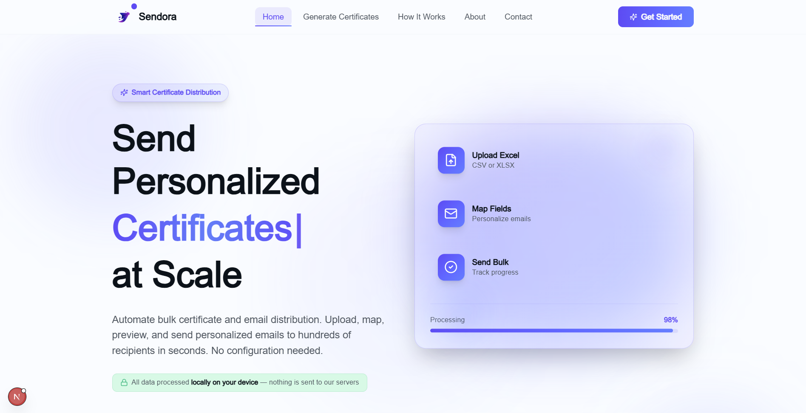
  <p><i>Modern landing page with feature highlights and call-to-action</i></p>
</div>

### About Page

<div align="center">
  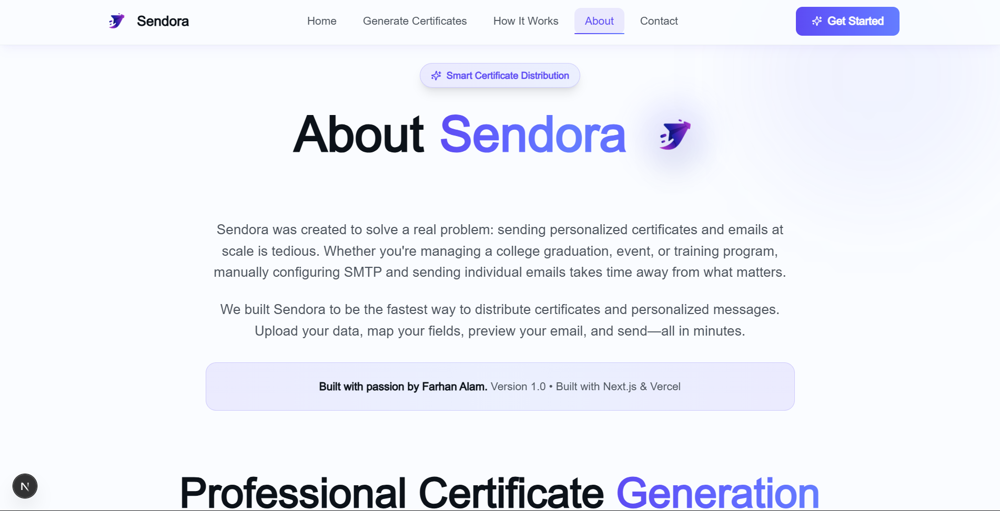
  <p><i>Learn about the platform's mission, values, and technology stack</i></p>
</div>

<div align="center">
  
  <p><i>Meet the developer and the story behind Sendora</i></p>
</div>

### How It Works

<div align="center">
  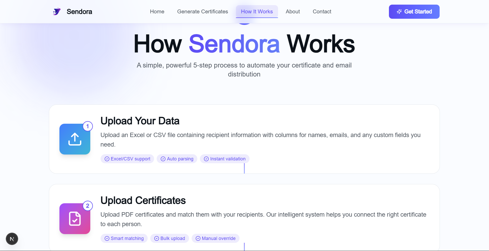
  <p><i>Step-by-step guide through the Sendora workflow</i></p>
</div>

### Certificate Generator

<div align="center">
  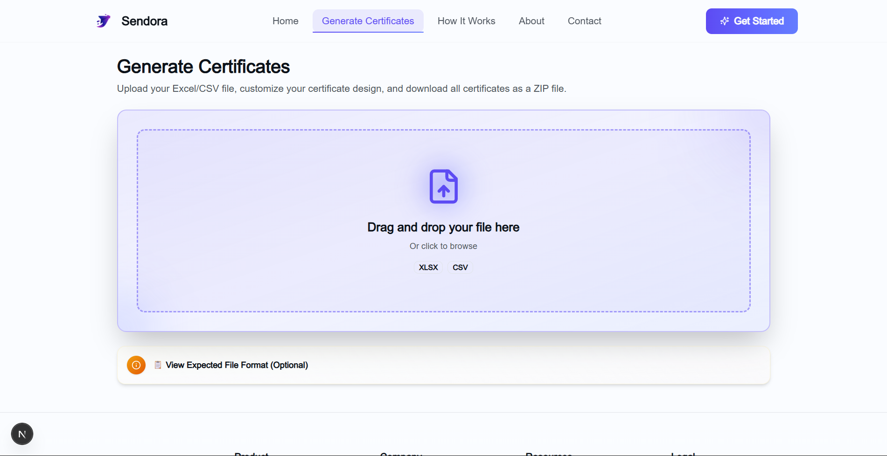
  <p><i>Built-in tool to create professional certificates from scratch</i></p>
</div>

<div align="center">
  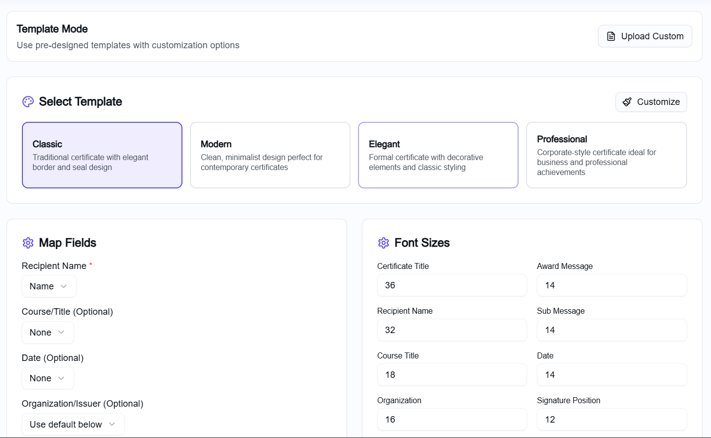
  <p><i>Choose from pre-designed certificate templates</i></p>
</div>

<div align="center">
  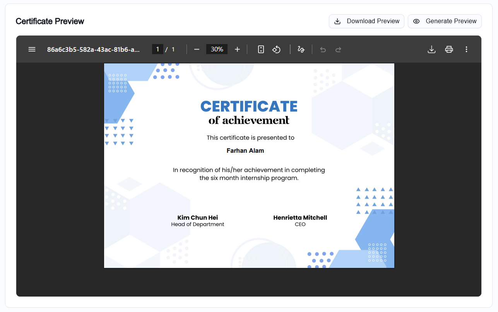
  <p><i>Preview your certificate before generation</i></p>
</div>

### Send Wizard - Complete Workflow

#### Step 1: Upload Your Data

<div align="center">
  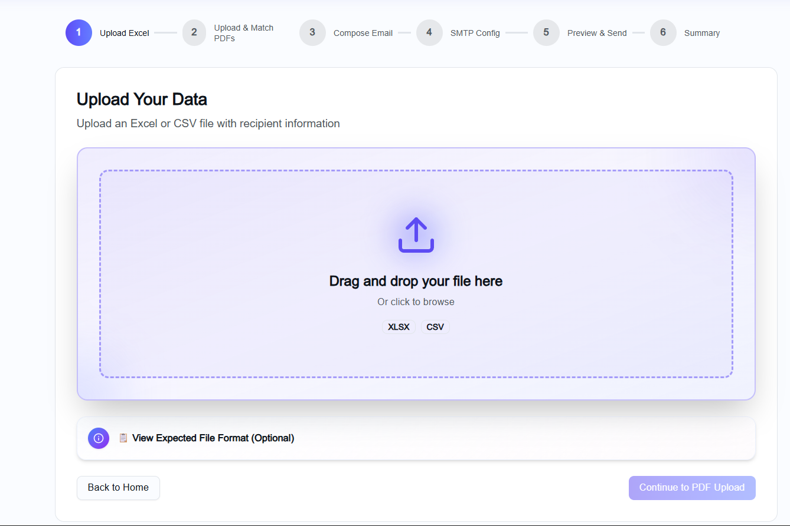
  <p><i>Upload Excel/CSV file with recipient information</i></p>
</div>

#### Step 2: Upload & Match Certificates

<div align="center">
  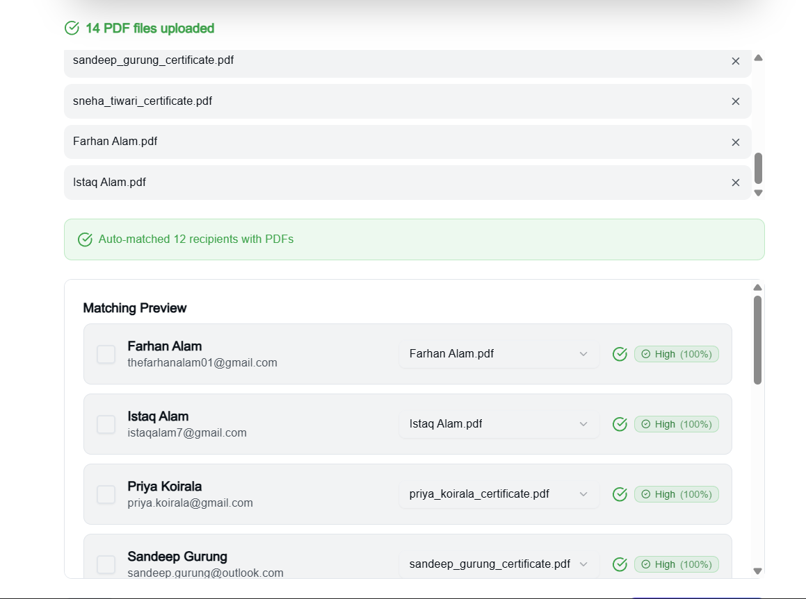
  <p><i>Upload PDF certificates and use smart matching to connect them with recipients</i></p>
</div>

#### Step 3: Compose Email

<div align="center">
  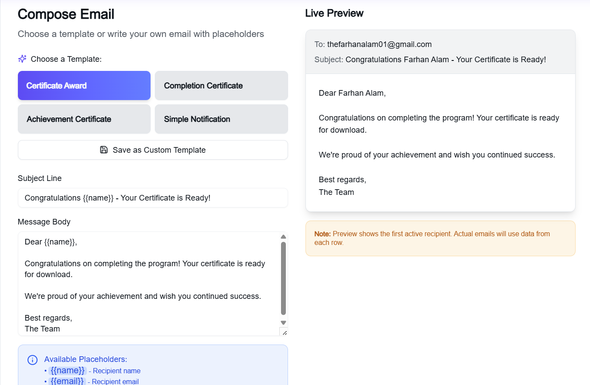
  <p><i>Write personalized email content with dynamic placeholders</i></p>
</div>

#### Step 4: Configure SMTP

<div align="center">
  
  <p><i>Choose default SMTP or configure your own mail server</i></p>
</div>

#### Step 5: Preview & Send

<div align="center">
  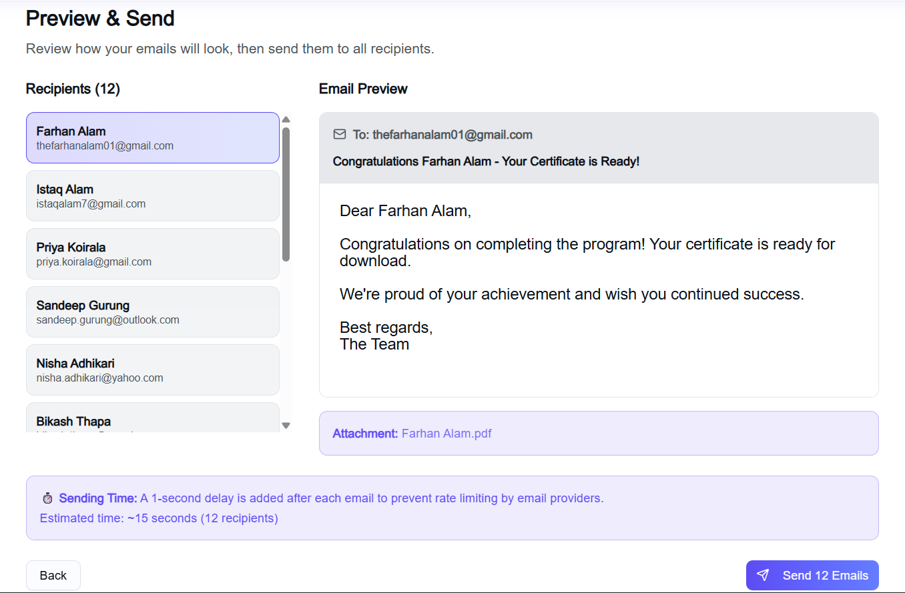
  <p><i>Review summary and send emails with real-time progress tracking</i></p>
</div>

<div align="center">
  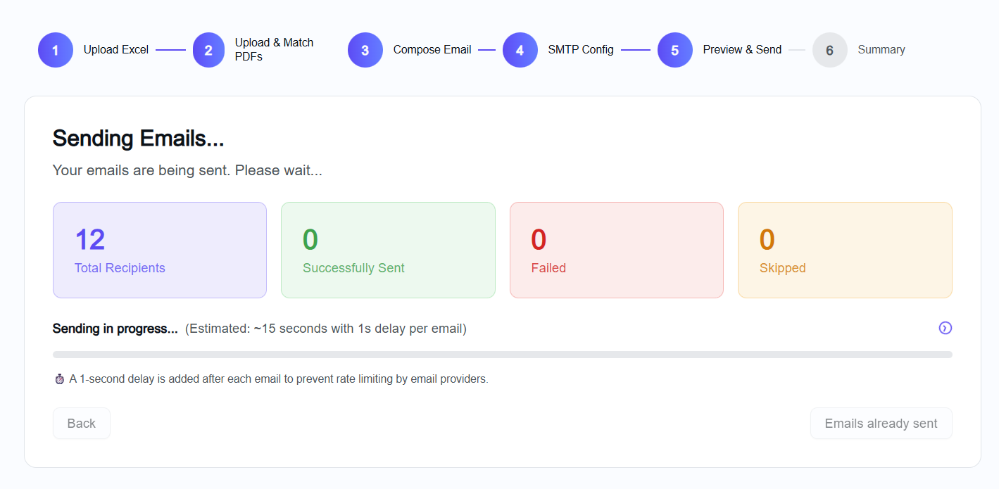
  <p><i>Monitor sending progress with detailed logs and status updates</i></p>
</div>

<div align="center">
  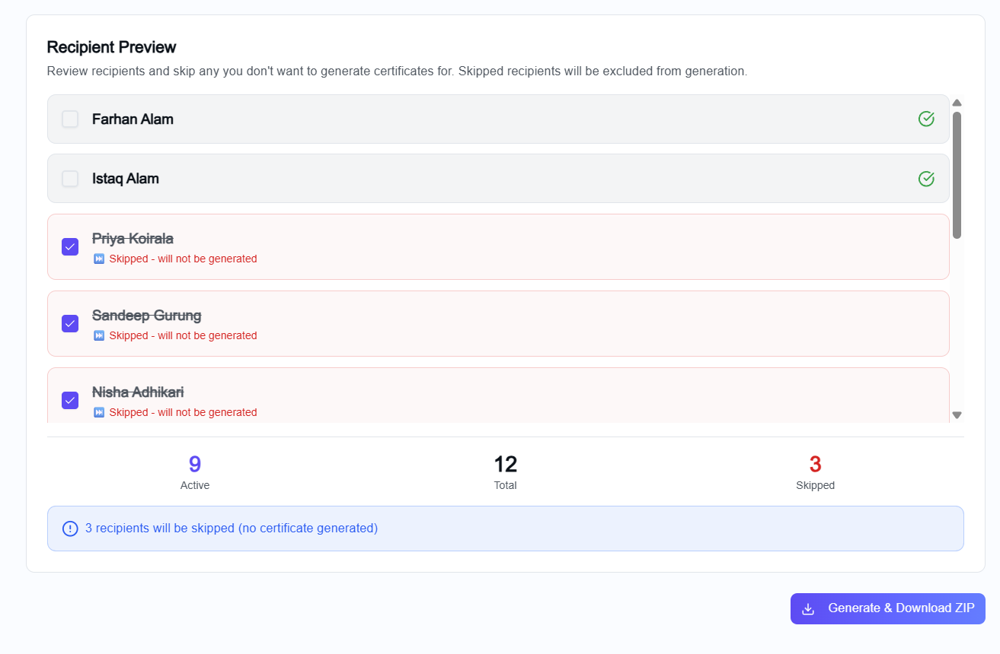
  <p><i>Preview how each recipient's email will appear</i></p>
</div>

### Contact Page

<div align="center">
  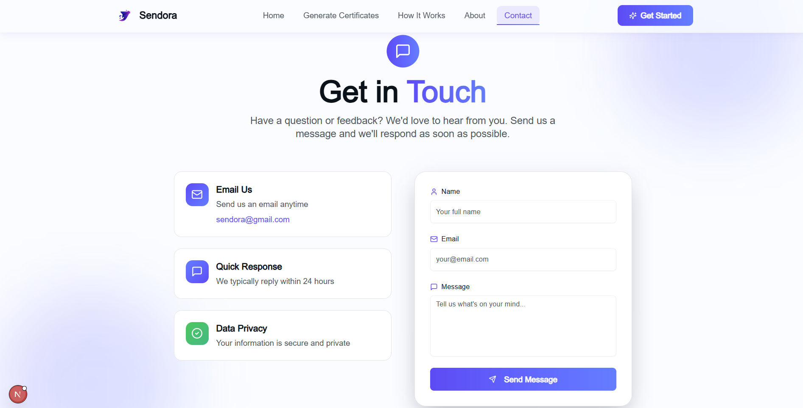
  <p><i>Get in touch with the Sendora team</i></p>
</div>

---

## 🛠️ Tech Stack

### Frontend

- **Framework**: [Next.js 15](https://nextjs.org/) - React framework with App Router
- **Language**: [TypeScript](https://www.typescriptlang.org/) - Type-safe JavaScript
- **Styling**: [Tailwind CSS v4](https://tailwindcss.com/) - Utility-first CSS framework
- **Animations**: [Framer Motion](https://www.framer.com/motion/) - Production-ready animation library
- **UI Components**: [shadcn/ui](https://ui.shadcn.com/) - Beautifully designed components
- **Icons**: [Lucide React](https://lucide.dev/) - Beautiful & consistent icons

### Backend & APIs

- **Email Service**: [Nodemailer](https://nodemailer.com/) - Email sending with SMTP
- **File Parsing**: [SheetJS (xlsx)](https://sheetjs.com/) - Excel/CSV file processing
- **PDF Handling**: [pdf-lib](https://pdf-lib.js.org/) - PDF generation and manipulation
- **API Routes**: Next.js API Routes - Serverless functions

### State Management & Data

- **State**: React Context API - Global state management
- **Forms**: React Hook Form - Performant form validation
- **Storage**: LocalStorage - Client-side configuration persistence

### Development Tools

- **Package Manager**: npm/pnpm - Dependency management
- **Linting**: ESLint - Code quality and consistency
- **Code Formatting**: Prettier - Code style enforcement
- **Type Checking**: TypeScript Compiler - Static type checking

### Hosting & Deployment

- **Platform**: [Vercel](https://vercel.com/) - Optimal Next.js hosting
- **CI/CD**: Vercel Git Integration - Automatic deployments
- **Domain**: Custom domain support with SSL
- **Analytics**: Vercel Analytics - Performance monitoring

### SEO & Performance

- **Meta Tags**: Next.js Metadata API - SEO optimization
- **Structured Data**: JSON-LD - Rich search results
- **Sitemap**: Dynamic XML sitemap generation
- **PWA**: Service Worker - Progressive Web App capabilities
- **Image Optimization**: Next.js Image - Automatic image optimization

---

## 🚀 Quick Start

Get Sendora up and running in less than 5 minutes!

### Prerequisites

Before you begin, ensure you have the following installed:

- **Node.js** (v18.0 or higher) - [Download](https://nodejs.org/)
- **npm** or **pnpm** - Package manager
- **Git** - Version control
- **SMTP Credentials** - For sending emails (Gmail, Outlook, etc.)

### Installation Methods

#### Method 1: Using shadcn CLI (Recommended)

The fastest way to get started with all dependencies pre-configured:

```bash

# Create new Next.js project with shadcn/ui

npm create shadcn-ui@latest my-sendora-app -- --skip-git

# Navigate to project directory

cd my-sendora-app

# Clone Sendora repository

git clone <https://github.com/FarhanAlam-Official/sendora.git> .

# Install dependencies

npm install

# Set up environment variables

cp .env.example .env.local

# Start development server

npm run dev
```

#### Method 2: Manual Installation

Clone and set up the repository manually:

```bash

# Clone the repository

git clone <https://github.com/FarhanAlam-Official/sendora.git>

# Navigate to project directory

cd sendora

# Install dependencies

npm install

# or using pnpm

pnpm install

# Copy environment variables

cp .env.example .env.local

# Start development server

npm run dev
```

#### Method 3: One-Click Deploy

Deploy directly to Vercel with one click:

[](https://vercel.com/new/clone?repository-url=https://github.com/FarhanAlam-Official/sendora)

### Verify Installation

After installation, open your browser and visit:

- **Local**: [http://localhost:3000](http://localhost:3000)
- You should see the Sendora home page

### First-Time Setup Checklist

- [ ] Node.js and npm installed
- [ ] Repository cloned successfully
- [ ] Dependencies installed (`node_modules` folder present)
- [ ] Environment variables configured (`.env.local` file created)
- [ ] SMTP credentials added to `.env.local`
- [ ] Development server running (`npm run dev`)
- [ ] Application accessible at localhost:3000

---

## 📋 Detailed Setup

## 🔐 Environment Variables

Sendora uses environment variables to configure SMTP settings and other sensitive information. Follow this guide to set them up correctly.

### Step 1: Create Environment File

Copy the example environment file:

```bash
cp .env.example .env.local
```

### Step 2: Configure Variables

Edit `.env.local` and add your configuration:

```env

# SMTP Configuration (Default SMTP)

SMTP_HOST=smtp.gmail.com
SMTP_PORT=587
SMTP_USER=<your-email@gmail.com>
SMTP_PASSWORD=your-app-password
SMTP_SECURE=false

# Admin Configuration

ADMIN_EMAIL=<admin@sendora.app>

# Optional: Base URL (auto-detected if not set)

NEXT_PUBLIC_BASE_URL=<http://localhost:3000>
```

### Required Variables

| Variable | Description | Example |
|----------|-------------|---------|
| `SMTP_HOST` | SMTP server hostname | `smtp.gmail.com` |
| `SMTP_PORT` | SMTP server port | `587` (TLS) or `465` (SSL) |
| `SMTP_USER` | Your email address | `your-email@gmail.com` |
| `SMTP_PASSWORD` | App password or SMTP password | `abcd efgh ijkl mnop` |
| `ADMIN_EMAIL` | Admin email for contact form | `admin@sendora.app` |

### Optional Variables

| Variable | Description | Default |
|----------|-------------|---------|
| `SMTP_SECURE` | Use SSL instead of TLS | `false` |
| `NEXT_PUBLIC_BASE_URL` | Base URL for links | Auto-detected |

---

### 📧 Email Provider Setup Guides

#### Gmail Configuration

1. **Enable 2-Step Verification**
   - Go to [Google Account Security](https://myaccount.google.com/security)
   - Enable 2-Step Verification

2. **Generate App Password**
   - Visit [App Passwords](https://myaccount.google.com/apppasswords)
   - Select "Mail" and "Other (Custom name)"
   - Copy the 16-character password

3. **Configure Environment**
   ```env
   SMTP_HOST=smtp.gmail.com
   SMTP_PORT=587
   SMTP_USER=<your-email@gmail.com>
   SMTP_PASSWORD=abcd efgh ijkl mnop  # App password
   SMTP_SECURE=false
   ```

#### Outlook/Hotmail Configuration

```env
SMTP_HOST=smtp-mail.outlook.com
SMTP_PORT=587
SMTP_USER=<your-email@outlook.com>
SMTP_PASSWORD=your-password
SMTP_SECURE=false
```

#### SendGrid Configuration

```env
SMTP_HOST=smtp.sendgrid.net
SMTP_PORT=587
SMTP_USER=apikey
SMTP_PASSWORD=your-sendgrid-api-key
SMTP_SECURE=false
```

#### Mailgun Configuration

```env
SMTP_HOST=smtp.mailgun.org
SMTP_PORT=587
SMTP_USER=your-mailgun-smtp-username
SMTP_PASSWORD=your-mailgun-smtp-password
SMTP_SECURE=false
```

#### AWS SES Configuration

```env
SMTP_HOST=email-smtp.us-east-1.amazonaws.com
SMTP_PORT=587
SMTP_USER=your-ses-smtp-username
SMTP_PASSWORD=your-ses-smtp-password
SMTP_SECURE=false
```

### Common SMTP Ports

| Port | Protocol | Security | Use Case |
|------|----------|----------|----------|
| `587` | STARTTLS | Encrypted | **Recommended** - Most providers |
| `465` | SSL/TLS | Encrypted | Legacy SSL connections |
| `25` | Plain | Unencrypted | Not recommended |
| `2525` | STARTTLS | Encrypted | Alternative to port 587 |

### Security Best Practices

1. **Never commit `.env.local`** - Already in `.gitignore`
2. **Use App Passwords** - Don't use your main account password
3. **Rotate Credentials** - Change passwords periodically
4. **Limit Permissions** - Use SMTP-only credentials when possible
5. **Monitor Usage** - Check email sending logs regularly

### Troubleshooting

#### "Invalid Login" Error

- Verify SMTP username and password
- For Gmail, ensure you're using an App Password
- Check if 2-Step Verification is enabled

#### "Connection Timeout" Error

- Verify SMTP_HOST is correct
- Check if port is allowed by firewall
- Try alternative ports (587 or 2525)

#### "TLS/SSL Error"

- For port 587, set `SMTP_SECURE=false`
- For port 465, set `SMTP_SECURE=true`
- Ensure your provider supports the chosen protocol

### Production Deployment

When deploying to production, configure environment variables in your hosting platform:

#### Vercel

1. Go to Project Settings → Environment Variables
2. Add each variable individually
3. Select appropriate environments (Production, Preview, Development)
4. Deploy or redeploy your project

#### Netlify

1. Go to Site Settings → Build & Deploy → Environment
2. Click "Edit variables"
3. Add each environment variable
4. Trigger a new deploy

#### Railway

1. Go to Variables tab in your project
2. Add each environment variable
3. Railway will auto-deploy

#### Docker

Create a `.env` file and use with Docker:
```bash
docker run -d --env-file .env sendora
```

---

## 📖 Usage Guide

### Navigation

Sendora has five main sections accessible from the navigation bar:

1. **🏠 Home** - Feature overview and introduction
2. **❓ How It Works** - Step-by-step process explanation
3. **🎓 Certificates** - Built-in certificate generator
4. **📧 Send** - Main email sending wizard (5 steps)
5. **📞 Contact** - Get in touch with support

---

### 📧 Send Wizard - Detailed Walkthrough

The Send Wizard is the core feature of Sendora. Follow these steps to send personalized emails and certificates:

#### Step 1: Upload Your Data 📤

**What to do:**

1. Prepare your recipient data in Excel (.xlsx) or CSV (.csv) format
2. Ensure you have columns for at least:
   - Recipient names
   - Email addresses
   - Any other custom data you want to include
3. Drag and drop your file or click to browse
4. Wait for automatic parsing and validation

**Tips:**

- ✅ Use descriptive column headers (e.g., "Full Name", "Email Address")
- ✅ Verify email addresses are properly formatted
- ✅ Remove empty rows before uploading
- ✅ Maximum recommended: 1000 recipients per batch

**Example Excel Structure:**

| Name | Email | Course | Date |
|------|-------|--------|------|
| John Doe | <john@example.com> | Web Development | 2024-01-15 |
| Jane Smith | <jane@example.com> | Data Science | 2024-01-20 |

---

#### Step 2: Upload & Match PDF Certificates 📄

**What to do:**

1. Upload your PDF certificate files
2. Use the smart matching system to connect certificates with recipients
3. Review confidence scores (High, Medium, Low)
4. Manually override matches if needed
5. Verify all recipients have assigned certificates

**Matching Options:**

- **Auto-Match** - AI analyzes filenames and content
- **Manual Match** - Drag and drop to assign certificates
- **Bulk Upload** - Upload multiple PDFs at once

**Tips:**

- ✅ Name PDFs with recipient identifiers (e.g., "John_Doe_Certificate.pdf")
- ✅ Review low-confidence matches carefully
- ✅ Use the preview feature to verify certificates
- ✅ PDFs should be under 10MB each

**Alternative:** Use the built-in Certificate Generator to create certificates on the fly!

---

#### Step 3: Compose Email ✍️

**What to do:**

1. Write your email subject line
2. Compose the email body with HTML formatting
3. Use dynamic placeholders to personalize content
4. Preview how emails will look to recipients

**Available Placeholders:**

| Placeholder | Description | Example Output |
|-------------|-------------|----------------|
| `{{name}}` | Recipient's name | "John Doe" |
| `{{email}}` | Recipient's email | "<john@example.com>" |
| `{{certificate_link}}` | Certificate download link | "https://..." |
| `{{[column_name]}}` | Any column from your file | Custom data |

**Example Email:**
```
Subject: Your {{course}} Certificate 🎓

Hi {{name}},

Congratulations on completing the {{course}} course!

We're pleased to share your certificate of completion. You can download it using the link below:

{{certificate_link}}

Thank you for your participation!

Best regards,
The Training Team
```

**Tips:**

- ✅ Keep subject lines under 60 characters
- ✅ Use personalization to increase engagement
- ✅ Test placeholders with preview mode
- ✅ Include clear call-to-action
- ✅ Proofread for spelling and grammar

---

#### Step 4: Configure SMTP ⚙️

**What to do:**

1. Choose between Default SMTP or Custom SMTP
2. If using custom SMTP, enter your credentials
3. Test the connection before proceeding
4. Save configuration for future use

**SMTP Options:**

**Option A: Default SMTP** (Easiest)

- Uses server-configured SMTP (if available)
- No configuration needed
- Limited to server settings

**Option B: Custom SMTP** (Recommended)

- Use your own email provider
- Full control over sender address
- Higher sending limits
- Better deliverability

**Configuration Fields:**

- **Host**: SMTP server address (e.g., smtp.gmail.com)
- **Port**: Usually 587 (TLS) or 465 (SSL)
- **Email**: Your sender email address
- **Password**: Your SMTP password or app password

**Tips:**

- ✅ Always test connection before sending
- ✅ Use app passwords for Gmail (not your main password)
- ✅ Check your provider's sending limits
- ✅ Save successful configurations for reuse
- ✅ Monitor your email provider's dashboard

---

#### Step 5: Preview & Send 🚀

**What to do:**

1. Review the summary of your campaign:
   - Total recipients
   - Subject line
   - SMTP configuration
   - Estimated time
2. Preview sample emails for accuracy
3. Configure sending options:
   - Batch size (emails per batch)
   - Delay between sends (avoid rate limiting)
4. Click "Start Sending"
5. Monitor real-time progress

**Sending Controls:**

- **Pause** - Temporarily stop sending
- **Resume** - Continue paused send
- **Cancel** - Stop and exit (can't be undone)

**Progress Tracking:**

- ✅ Real-time progress bar
- ✅ Success/failure counts
- ✅ Detailed logs for each email
- ✅ Error messages for failed sends
- ✅ Export logs as CSV

**Tips:**

- ✅ Test with 2-3 recipients first
- ✅ Use delays to avoid SMTP throttling
- ✅ Keep the tab open while sending
- ✅ Monitor error logs for issues
- ✅ Download logs for record-keeping

**Recommended Settings:**

- **Gmail**: 100 emails/batch, 1000ms delay
- **SendGrid**: 250 emails/batch, 500ms delay  
- **Custom SMTP**: Check your provider's limits

---

### 🎓 Certificate Generator

Create professional certificates without external tools:

1. **Choose Template** or **Start from Scratch**
2. **Customize Design**:
   - Add recipient name fields
   - Include course/event details
   - Upload logos and signatures
   - Adjust colors and fonts
3. **Preview Certificate**
4. **Generate PDF**
5. **Download** or **Use in Send Wizard**

**Features:**

- Multiple pre-designed templates
- Drag-and-drop editor
- Custom fonts and colors
- Logo and signature support
- Instant PDF generation
- High-resolution output (300 DPI)

---

### 💡 Pro Tips

**For Best Results:**

1. **Test First** - Send to yourself before mass sending
2. **Check Spam** - Ask recipients to check spam folders
3. **Warm Up** - Start with small batches if using new SMTP
4. **Monitor Logs** - Review error logs for patterns
5. **Backup Data** - Save your Excel file and logs
6. **Verify Links** - Ensure certificate links are accessible
7. **Timing** - Send during business hours for better engagement
8. **Follow-up** - Send reminder emails for non-openers

**Avoid These Mistakes:**

- ❌ Sending without testing
- ❌ Using too many placeholders
- ❌ Ignoring SMTP limits
- ❌ Sending to invalid emails
- ❌ Not monitoring progress
- ❌ Using spammy subject lines

---

## 📁 Project Structure

```
sendora/
├── app/                                 # Next.js App Router
│   ├── page.tsx                        # Home page (landing)
│   ├── layout.tsx                      # Root layout with providers
│   ├── error.tsx                       # Error boundary
│   ├── not-found.tsx                   # 404 page
│   ├── globals.css                     # Global styles
│   ├── manifest.ts                     # PWA manifest
│   ├── sitemap.ts                      # Dynamic sitemap
│   │
│   ├── about/                          # About page
│   │   ├── page.tsx                   # About page component
│   │   └── metadata.ts                # SEO metadata
│   │
│   ├── how-it-works/                   # How It Works page
│   │   ├── page.tsx                   # Process explanation
│   │   └── metadata.ts                # SEO metadata
│   │
│   ├── certificates/                   # Certificate Generator
│   │   ├── page.tsx                   # Generator page
│   │   └── metadata.ts                # SEO metadata
│   │
│   ├── contact/                        # Contact page
│   │   └── page.tsx                   # Contact form
│   │
│   ├── send/                           # Main Send Wizard
│   │   ├── page.tsx                   # Wizard container
│   │   └── metadata.ts                # SEO metadata
│   │
│   ├── demo-toast/                     # Toast demo (dev)
│   │   └── page.tsx                   # Notification showcase
│   │
│   ├── admin/                          # Admin pages
│   │   └── smtp-config/               # SMTP configuration
│   │       └── page.tsx
│   │
│   └── api/                            # API Routes
│       ├── contact/                    # Contact form API
│       │   └── route.ts
│       ├── health/                     # Health check
│       │   └── route.ts
│       ├── sendEmails/                 # Single email API
│       │   └── route.ts
│       ├── sendEmails-batch/           # Batch email API
│       │   └── route.ts
│       └── testSMTP/                   # SMTP testing
│           └── route.ts
│
├── components/                          # React Components
│   ├── navbar.tsx                      # Navigation bar
│   ├── footer.tsx                      # Footer component
│   ├── theme-provider.tsx              # Dark mode provider
│   │
│   ├── send-wizard-context.tsx         # Wizard state management
│   ├── wizard-step-indicator.tsx       # Progress indicator
│   │
│   ├── step-upload.tsx                 # Step 1: Upload data
│   ├── step-pdf-upload-match.tsx       # Step 2: Match PDFs
│   ├── step-compose.tsx                # Step 3: Compose email
│   ├── step-smtp.tsx                   # Step 4: SMTP config
│   ├── step-preview-send.tsx           # Step 5: Send emails
│   ├── step-summary.tsx                # Results summary
│   │
│   ├── certificate-generator-standalone.tsx  # Certificate tool
│   ├── certificate-templates.tsx       # Template library
│   ├── send-results.tsx                # Send status display
│   │
│   ├── error-pages/                    # Error components
│   │   ├── GenericErrorPage.tsx
│   │   ├── NetworkErrorPage.tsx
│   │   ├── NotFoundErrorPage.tsx
│   │   └── ServerErrorPage.tsx
│   │
│   ├── notifications/                  # Toast system
│   │   └── notification-provider.tsx
│   │
│   └── ui/                             # shadcn/ui components
│       ├── button.tsx
│       ├── input.tsx
│       ├── card.tsx
│       ├── dialog.tsx
│       ├── toast.tsx
│       ├── progress.tsx
│       └── ... (50+ components)
│
├── lib/                                # Utility libraries
│   ├── utils.ts                        # Helper functions
│   ├── notifications.ts                # Toast manager
│   ├── certificate-generator.ts        # Certificate logic
│   ├── pdf-utils.ts                    # PDF operations
│   ├── font-manager.ts                 # Font handling
│   └── structured-data.ts              # SEO schemas
│
├── hooks/                              # Custom React hooks
│   ├── use-toast.ts                    # Toast hook
│   └── use-mobile.ts                   # Mobile detection
│
├── types/                              # TypeScript types
│   ├── certificate.ts                  # Certificate types
│   └── nodemailer.d.ts                 # Email types
│
├── public/                             # Static assets
│   ├── logo.png                        # Brand logo
│   ├── user.png                        # Profile image
│   ├── robots.txt                      # SEO robots file
│   ├── favicon/                        # Favicon set
│   │   ├── favicon.ico
│   │   ├── icon.svg
│   │   └── apple-touch-icon.png
│   └── screenshots/                    # App screenshots
│       ├── home.png
│       ├── about.png
│       ├── how-it-works.png
│       ├── core-app-step-1.png
│       ├── core-app-step-2.png
│       ├── core-app-step-3.png
│       ├── core-app-step-4.png
│       ├── core-app-step-5.png
│       └── ... (more screenshots)
│
├── styles/                             # Style files
│   └── globals.css                     # Global CSS
│
├── doc/                                # Documentation
│   ├── README.md                       # Docs overview
│   ├── api/                            # API docs
│   ├── component/                      # Component docs
│   ├── guide/                          # User guides
│   ├── seo/                            # SEO docs
│   ├── technical/                      # Technical specs
│   └── template/                       # Templates
│
├── .env.example                        # Environment template
├── .env.local                          # Local environment (gitignored)
├── .gitignore                          # Git ignore rules
├── components.json                     # shadcn/ui config
├── next.config.mjs                     # Next.js config
├── package.json                        # Dependencies
├── pnpm-lock.yaml                      # Lock file
├── postcss.config.mjs                  # PostCSS config
├── tailwind.config.ts                  # Tailwind config
├── tsconfig.json                       # TypeScript config
├── vitest.config.ts                    # Vitest config
├── README.md                           # This file
└── LICENSE                             # MIT license
```

### Key Directories Explained

| Directory | Purpose |
|-----------|---------|
| `app/` | Next.js 15 App Router - pages and API routes |
| `components/` | Reusable React components |
| `lib/` | Utility functions and business logic |
| `hooks/` | Custom React hooks for shared logic |
| `types/` | TypeScript type definitions |
| `public/` | Static files served directly |
| `doc/` | Comprehensive documentation |

---

## 🔌 API Documentation

Sendora provides RESTful API endpoints for email sending and configuration testing.

### API Endpoints

#### 1. Send Single Email

**POST** `/api/sendEmails`

Send a single personalized email with PDF attachment.

**Request Body:**
```json
{
  "to": "<recipient@example.com>",
  "subject": "Your Certificate",
  "body": "<p>Congratulations {{name}}!</p>",
  "smtpConfig": "default" | "custom",
  "customSMTP": {
    "host": "smtp.gmail.com",
    "port": "587",
    "email": "<sender@gmail.com>",
    "password": "app-password"
  },
  "pdfAttachment": {
    "filename": "certificate.pdf",
    "content": "base64-encoded-pdf"
  }
}
```

**Response (Success):**
```json
{
  "success": true,
  "messageId": "<unique-id@domain>",
  "timestamp": "2024-01-15T10:30:00.000Z",
  "recipient": "<recipient@example.com>"
}
```

**Response (Error):**
```json
{
  "error": "Error message",
  "code": "ERROR_CODE"
}
```

---

#### 2. Send Batch Emails

**POST** `/api/sendEmails-batch`

Send multiple emails in batch with progress tracking.

**Request Body:**
```json
{
  "emails": [
    {
      "to": "user1@example.com",
      "subject": "Certificate",
      "body": "<p>Hello!</p>",
      "pdfAttachment": {
        "filename": "cert1.pdf",
        "content": "base64-string"
      }
    }
  ],
  "smtpConfig": "default",
  "delayBetween": 500
}
```

**Response:**
```json
{
  "success": 10,
  "failed": 0,
  "totalTime": 5234,
  "results": [
    {
      "email": "user1@example.com",
      "success": true,
      "messageId": "<id>"
    }
  ]
}
```

---

#### 3. Test SMTP Configuration

**POST** `/api/testSMTP`

Verify SMTP credentials before sending.

**Request Body:**
```json
{
  "host": "smtp.gmail.com",
  "port": "587",
  "email": "<your@email.com>",
  "password": "your-password"
}
```

**Response (Success):**
```json
{
  "success": true,
  "message": "SMTP connection verified"
}
```

**Response (Error):**
```json
{
  "error": "Connection failed"
}
```

---

#### 4. Contact Form

**POST** `/api/contact`

Submit contact form messages.

**Request Body (FormData):**

- `name`: Sender name
- `email`: Sender email
- `message`: Message content

**Response:**
```json
{
  "success": true,
  "message": "Message sent successfully"
}
```

---

#### 5. Health Check

**GET** `/api/health`

Check API and SMTP status.

**Response:**
```json
{
  "api": "operational",
  "timestamp": "2024-01-15T10:30:00.000Z",
  "smtp": {
    "configured": true,
    "verified": true,
    "host": "smtp.gmail.com",
    "port": 587
  }
}
```

---

### Rate Limiting

To prevent abuse and ensure fair usage:

- **Batch emails**: Configurable delay between sends (default: 500ms)
- **SMTP providers**: Respect provider limits (Gmail: 500/day)
- **Retry logic**: Max 3 retries per email with 1000ms delay

### Error Codes

| Code | Description |
|------|-------------|
| `INVALID_EMAIL` | Email format validation failed |
| `SMTP_ERROR` | SMTP connection or authentication failed |
| `SEND_ERROR` | Email sending failed |
| `VALIDATION_ERROR` | Missing or invalid request data |

---

## 🚀 Deployment

### Deploy to Vercel (Recommended)

Vercel provides the best hosting experience for Next.js applications:

#### Option 1: Vercel CLI

```bash

# Install Vercel CLI

npm install -g vercel

# Login to Vercel

vercel login

# Deploy

vercel

# Deploy to production

vercel --prod
```

#### Option 2: GitHub Integration

1. Push your code to GitHub
2. Visit [vercel.com/new](https://vercel.com/new)
3. Import your repository
4. Configure environment variables
5. Deploy!

#### Option 3: One-Click Deploy

[](https://vercel.com/new/clone?repository-url=https://github.com/FarhanAlam-Official/sendora)

### Environment Variables in Production

After deployment, add environment variables:

1. Go to your project on Vercel
2. Navigate to **Settings** → **Environment Variables**
3. Add each variable:
   - `SMTP_HOST`
   - `SMTP_PORT`
   - `SMTP_USER`
   - `SMTP_PASSWORD`
   - `ADMIN_EMAIL`
   - `SMTP_SECURE`
4. Redeploy to apply changes

### Custom Domain Setup

1. Go to **Settings** → **Domains**
2. Add your custom domain
3. Configure DNS records as instructed
4. Wait for propagation (usually 24-48 hours)
5. SSL certificate is automatically provisioned

---

### Deploy to Other Platforms

#### Netlify

```bash

# Install Netlify CLI

npm install -g netlify-cli

# Login

netlify login

# Deploy

netlify deploy

# Deploy to production

netlify deploy --prod
```

#### Docker

```dockerfile

# Dockerfile

FROM node:18-alpine

WORKDIR /app

COPY package*.json ./
RUN npm install

COPY . .
RUN npm run build

EXPOSE 3000

CMD ["npm", "start"]
```

```bash

# Build and run

docker build -t sendora .
docker run -p 3000:3000 --env-file .env sendora
```

#### Railway

1. Connect your GitHub repository
2. Add environment variables
3. Deploy automatically on push

---

## 🤝 Contributing

We welcome contributions from the community! Here's how you can help:

### Ways to Contribute

- 🐛 **Report Bugs** - Open an issue with details
- 💡 **Suggest Features** - Share your ideas
- 📝 **Improve Documentation** - Help others understand
- 🔧 **Submit Pull Requests** - Fix bugs or add features
- ⭐ **Star the Repository** - Show your support

### Development Workflow

1. **Fork the repository**
   ```bash
   git clone <https://github.com/your-username/sendora.git>
   ```

2. **Create a feature branch**
   ```bash
   git checkout -b feature/amazing-feature
   ```

3. **Make your changes**
   - Follow existing code style
   - Add comments for complex logic
   - Update documentation if needed

4. **Test thoroughly**
   ```bash
   npm run dev
   npm run build
   npm run lint
   ```

5. **Commit your changes**
   ```bash
   git commit -m "Add amazing feature"
   ```

6. **Push to your fork**
   ```bash
   git push origin feature/amazing-feature
   ```

7. **Open a Pull Request**
   - Describe your changes
   - Reference any related issues
   - Wait for review

### Code Style Guidelines

- Use TypeScript for type safety
- Follow existing component patterns
- Write meaningful commit messages
- Add JSDoc comments for functions
- Keep components focused and reusable

### Pull Request Checklist

- [ ] Code follows project style guidelines
- [ ] Self-review of code completed
- [ ] Comments added for complex logic
- [ ] Documentation updated (if needed)
- [ ] No new warnings or errors
- [ ] Tested in development environment
- [ ] Screenshots added (for UI changes)

---

## 🗺️ Roadmap

### Upcoming Features

#### Version 2.0 (Q1 2025)

- [ ] **User Authentication** - Login, signup, and user profiles
- [ ] **Dashboard** - Personal sending history and analytics
- [ ] **Template Library** - Save and reuse email templates
- [ ] **Scheduled Sending** - Schedule emails for later
- [ ] **A/B Testing** - Test different email variants

#### Version 2.1 (Q2 2025)

- [ ] **Google Sheets Integration** - Import data from Sheets
- [ ] **Webhook Support** - Receive status updates via webhooks
- [ ] **Email Analytics** - Open rates, click tracking
- [ ] **Recipient Management** - Organize contacts in groups
- [ ] **Advanced Filters** - Filter recipients before sending

#### Version 3.0 (Q3 2025)

- [ ] **Multi-language Support** - Internationalization (i18n)
- [ ] **API Key System** - Programmatic access to Sendora
- [ ] **Team Collaboration** - Multi-user accounts
- [ ] **Custom Domains** - Send from your own domain
- [ ] **Advanced Reporting** - Export detailed analytics

### Community Requested

- [ ] SMS notifications alongside emails
- [ ] Calendar event attachments (.ics files)
- [ ] Automated follow-up sequences
- [ ] Integration with CRMs (Salesforce, HubSpot)
- [ ] QR code generation for certificates
- [ ] Blockchain certificate verification

**Want a feature?** [Open an issue](https://github.com/FarhanAlam-Official/sendora/issues) or start a discussion!

---

## SEO Implementation

Sendora includes comprehensive SEO optimization out of the box:

### ✅ Implemented Features

- **robots.txt** - Search engine crawler instructions
- **sitemap.xml** - Dynamic sitemap for all pages
- **Structured Data** - JSON-LD schema markup (Organization, WebApplication, Product, HowTo)
- **Meta Tags** - Complete SEO metadata on all pages
- **Open Graph** - Social media sharing optimization
- **PWA Support** - Progressive Web App manifest
- **Security Headers** - X-Frame-Options, CSP, and more
- **Mobile Optimization** - Mobile-first responsive design

### 📚 SEO Documentation

- `SEO_IMPLEMENTATION_GUIDE.md` - Complete SEO documentation
- `SEO_QUICK_START.md` - Quick reference checklist
- `SEO_SUMMARY.md` - Implementation summary

### 🎯 Target Keywords

- bulk email sender
- certificate distribution
- email automation
- excel to email
- csv email sender
- smtp email sender

### 🚀 Getting Started with SEO

1. Verify ownership in [Google Search Console](https://search.google.com/search-console)
2. Submit sitemap: `https://sendora.vercel.app/sitemap.xml`
3. Set up [Google Analytics 4](https://analytics.google.com/)
4. Review `SEO_QUICK_START.md` for next steps

For detailed SEO information, see the SEO documentation files in the project root.

## Deployment

Deploy to Vercel:

```bash
vercel
```

## License

MIT

## 📞 Support

Need help? We're here for you!

### Getting Help

- 📧 **Email**: [sendora@gmail.com](mailto:sendora@gmail.com)
- 🐛 **Bug Reports**: [Open an issue](https://github.com/FarhanAlam-Official/sendora/issues)
- 💬 **Questions**: [GitHub Discussions](https://github.com/FarhanAlam-Official/sendora/discussions)
- 📝 **Contact Form**: [sendoraa.vercel.app/contact](https://sendoraa.vercel.app/contact)

### Common Issues

<details>
<summary><b>Email sending fails with "Invalid Login"</b></summary>

**Solution:**

1. For Gmail, use an [App Password](https://support.google.com/accounts/answer/185833)
2. Enable 2-Step Verification first
3. Don't use your regular Gmail password
4. Verify SMTP_USER matches your email exactly

</details>

<details>
<summary><b>Emails go to spam folder</b></summary>

**Solution:**

1. Add SPF and DKIM records to your domain
2. Use a custom email domain (not Gmail/Outlook)
3. Avoid spam trigger words in subject
4. Send from a verified email address
5. Ask recipients to whitelist your email

</details>

<details>
<summary><b>CSV/Excel file not parsing correctly</b></summary>

**Solution:**

1. Ensure proper column headers in first row
2. Remove any empty rows or columns
3. Save file with UTF-8 encoding
4. Use .xlsx format for best compatibility
5. Verify email column has valid email addresses

</details>

<details>
<summary><b>Certificate PDFs not attaching</b></summary>

**Solution:**

1. Check PDF file size (max 10MB per file)
2. Ensure PDFs are not corrupted
3. Use the preview feature to verify PDFs
4. Re-upload PDFs if matching fails
5. Check browser console for errors

</details>

<details>
<summary><b>SMTP connection timeout</b></summary>

**Solution:**

1. Verify SMTP_HOST is correct
2. Check if firewall is blocking port 587
3. Try alternative port (2525 or 465)
4. Confirm your provider allows SMTP
5. Test with the "Test Connection" button

</details>

### FAQ

**Q: Is Sendora free to use?**  
A: Yes! Sendora is completely free and open-source under the MIT license.

**Q: How many emails can I send?**  
A: There's no limit in Sendora, but your SMTP provider may have limits (Gmail: 500/day).

**Q: Is my data secure?**  
A: Yes! Your data never leaves your browser until you click send. We don't store any recipient data.

**Q: Can I use Sendora commercially?**  
A: Absolutely! The MIT license allows commercial use.

**Q: Does Sendora work offline?**  
A: Partial PWA support allows some offline functionality, but sending emails requires internet.

**Q: Can I customize the certificate templates?**  
A: Yes! Use the built-in certificate generator with full customization.

---

## 👨‍💻 About the Developer

**Sendora** was created by [Farhan Alam](https://github.com/FarhanAlam-Official), a passionate full-stack developer dedicated to building tools that solve real-world problems.

### Connect

- **GitHub**: [@FarhanAlam-Official](https://github.com/FarhanAlam-Official)
- **Email**: [thefarhanalam01@gmail.com](mailto:thefarhanalam01@gmail.com)
- **Portfolio**: [Visit Website](https://github.com/FarhanAlam-Official)

### Other Projects

Check out more projects on [GitHub](https://github.com/FarhanAlam-Official)!

---

## ⭐ Show Your Support

If Sendora helped you, consider:

- ⭐ **Star this repository** on GitHub
- 🐦 **Share on social media** with #Sendora
- 📝 **Write a review** or blog post
- 🤝 **Contribute** to the codebase
- 💬 **Spread the word** to colleagues

<div align="center">
  <a href="https://github.com/FarhanAlam-Official/sendora">
    
  </a>
  <a href="https://github.com/FarhanAlam-Official/sendora/fork">
    
  </a>
</div>

---

## 📄 License

This project is licensed under the **MIT License** - see the [LICENSE](LICENSE) file for details.

### What this means

- ✅ Commercial use allowed
- ✅ Modification allowed
- ✅ Distribution allowed
- ✅ Private use allowed
- ℹ️ License and copyright notice required

---

<div align="center">
  <p>Made with ❤️ by <a href="https://github.com/FarhanAlam-Official">Farhan Alam</a></p>
  <p>
    <a href="https://sendoraa.vercel.app">Live Demo</a> •
    <a href="https://github.com/FarhanAlam-Official/sendora">GitHub</a> •
    <a href="https://github.com/FarhanAlam-Official/sendora/issues">Report Bug</a> •
    <a href="https://github.com/FarhanAlam-Official/sendora/issues">Request Feature</a>
  </p>
  <p>
    <sub>Built with Next.js 15 • Deployed on Vercel • Powered by Nodemailer</sub>
  </p>
</div>
